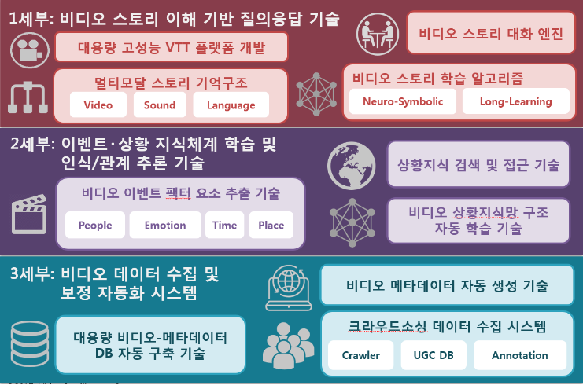
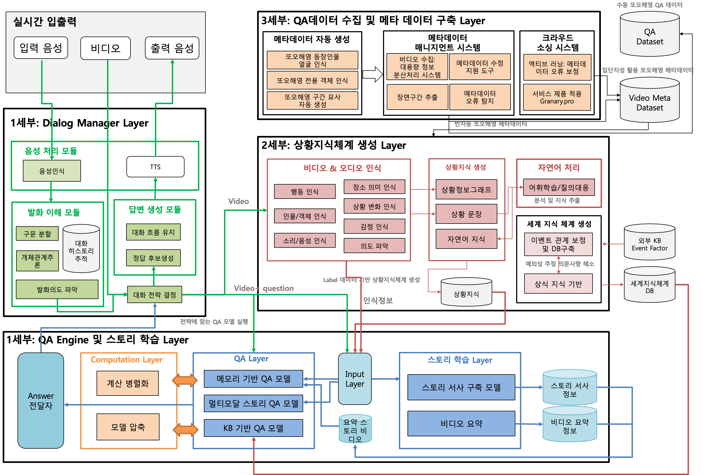

# VIP-public

## 개요

 최근 Watson, Siri, AlphaGo, Echo  등을 통하여 인공지능이 빠르게 산업화되고 있다. 그러나 아직 인간 수준의 인공지능을 성취하기 위해서는 AI 기술이 딥러닝을 넘어서 범용인공지능기술(Artificial General Intelligence, AGI)로 발전되어야 한다. 
본 과제는 비디오 빅데이터를 사용하여 인간 수준의 비디오 이해 지능 기술을 개발하는 것을 목표로 한다. 비디오는 언어능력과 시각능력이 결합되어 있으며 사진이나 문장을 넘어서 장면과 대사들의 시퀀스로 구성된 스토리의 전개를 포함하며 비디오 스토리를 이해하는 기술은 AGI에 다가가는 원천기술이다. 
본 과제는 이러한 비전을 달성하기 위하여 인간 수준의 비디오 이해 지능 플랫폼(Video Intelligence Platform, VIP)을 개발하고 그 성능을 차세대 인공지능 챌린지인 비디오 튜링 테스트(Video Turing Test, VTT)를 통하여 검증하고자 한다. 이를 위해서 세 가지 핵심 기술을 개발한다.

## 비디오 이해 지능 플랫폼 (VIP) 개발

### 1세부: 비디오 스토리 이해 기반 질의응답 기술
 비디오 스토리 이해를 위해서 사건의 장기적인 전개를 효율적으로 기억하는 멀티모달 비디오 스토리 기억 구조와 그 학습 기술을 개발한다. 이 스토리 기억 구조를 이용하여 비디오 이해를 바탕으로 VTT를 통과할 수 있는 비디오 스토리 대화 엔진을 개발한다. 그리고 대용량의 비디오를 처리할 수 있는 고성능의 VTT 플랫폼을 개발하여 대회를 개최한다.

### 2세부: 이벤트/상황 지식체계 학습 및 인식/관계 추론 기술
 비디오 데이터는 이벤트와 상황 이해를 기반으로 지식 베이스를 구성하고 세계지식 구축해야 하며, 이는 컴퓨터 비전 기술과 음성 언어 처리 기술의 복합적 적용이 요구된다. 상황 이해 지식 베이스를 구성하기 위해 추상화된 개념 지도를 형성하고 지식 표상을 학습하여 VTT 시스템에서 활용 가능하게 한다. 장면 수준 이해를 위해 캐릭터 행동과 장소 분석 등을 수행하며 이들 간의 관계를 추론하는 기술을 개발한다.

### 3세부: 비디오 데이터 수집 및 보정 자동화 시스템 개발
 대용량 학습 데이터 구축은 딥러닝을 기반으로 하는 비디오 스토리 이해 대화형 VTT 시스템에서 필수적인 학습 요소이다. 비디오 이해를 위한 대용량의 학습 데이터 구축을 통해 반지도 학습과 능동 학습을 이용하며, 데이터 수집기, UGC DB, 자동화된 대용량 비디오 태깅 시스템을 개발한다.

## 기술개발 결과의 활용 방안 및 기대효과
### > 활용 방안
- 대화형 질의 응답 프레임워크 구축
- 상담형 질의응답 시스템 상용화
- 스토리 기반 영상 생성 기술 활용
- 음성 대화 로봇에 활용
- 분산 AI 플랫폼 제공
- 모델 압축 기술 적용 프레임워크 제공
- 모델 압축 실시간 인공지능 서비스 기술 이전
- 영상 자동 요약 기술 활용

### > 기대효과
- 기술적 측면
  - 서사 이해와 관련된 새로운 응용 연구 창출
  - 비디오 데이터 특성을 고려한 효율적인 자동분산 플랫폼 기술
  - 대화형 질의 응답 및 지식베이스 구축에 활용되는 다양한 자연어처리 기술
  - 문장으로 표현된 의도를 이해하는 방식의 요약 기술

- 경제적, 산업적 측면
  - 서사 기반 디지털 콘텐츠 기술 인력 양성 기여
  - 진보된 대화형 인터페이스 보급
  - 효율적인 자동 분산 기능
  - 다양한 기기에서 학습된 모델들을 활용하여 딥러닝의 적용 분야를 넓힘
  - 영상 제작에 대한 진입장벽을 낮춤
  - 감성 지능 프로그램 개발
  - 언어지능 기반 융합AI 기술이 확산
  - 새로운 포탈 비즈니스
  - 대화형 질의응답 기술을 활용한 새로운 사용자 인터페이스 산업 형성
  - 대화형 질의 응답 기술을 개발해 글로벌 기업으로부터의 수입 감소와 수출을 통한 글로별 경쟁력 강화

- 사회적 측면
  - 새로운 이윤 및 일자리 창출
  - 인공지능 서비스의 대중화

## 링크

[링크](주소)
